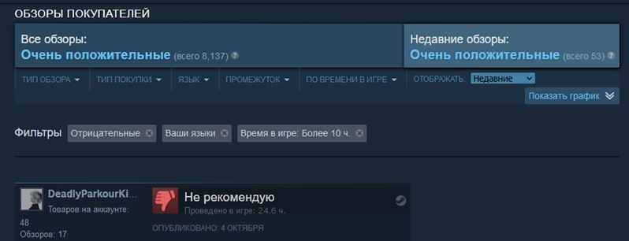
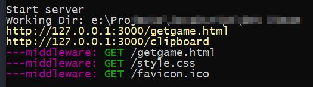
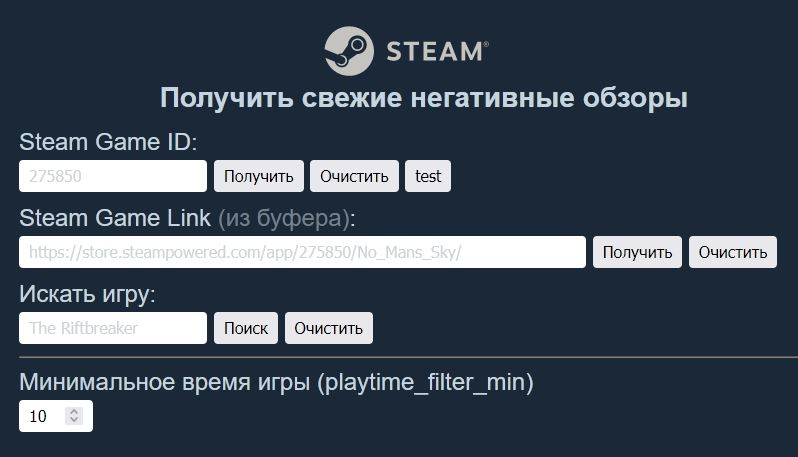
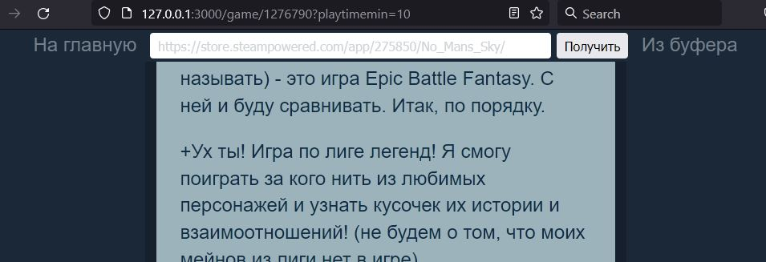

# Get Steam

Проект для отображения обзоров на игры из **Steam** с заранее настроенным фильтром.
Использованные технологии: **JavaScript, Node.js, Express, HTML, CSS, LESS, REST API**.

Проект состоит из **Express** сервера `server.js` для формирования запроса, получения данных, обработку и их последующую отправку браузеру пользователя.

Я обнаружил, что часто использую одинаковые настройки фильтров Steam, чтобы лучше ознакомиться с недостатками игр по обзорам игроков, которые уже провели достаточно времени за игрой. Чтобы быстро получить к ним доступ и читать обзоры с приятным мне оформлением без лишних отвлекающих деталей я написал этот проект.

## Главная страница

На главной странице <http://127.0.0.1:3000> или <http://127.0.0.1:3000/getgame.html> можно получить доступ к обзорам выбранной игры, введя ее ID (номер вида 1276790) или ссылку на страницу игры в магазине. Можно перейти сразу к обзорам <http://127.0.0.1:3000/clipboard>, если URL страницы находится в буфере обмена.

Доступен поиск по названию. Для этого используется локальная [копия базы данных Steam](http://api.steampowered.com/ISteamApps/GetAppList/v0002/?format=json). Я решил сделать так, потому что оригинал загружается очень долго. Но локальную копию придется обновлять самому.

Дополнительно доступна настройка минимального времени игры в часах (по умолчанию 10).

## Страница отзывов

На странице отзывов в шапке доступно поле ввода для ссылки на новую игру, можно перейти на главную страницу или сразу к ссылке в буфере обмена.

## URL доступа

`http://127.0.0.1:3000/game/1276790?playtimemin=10`

Полная ссылка на отзывы формируется из:
- обязательной части `http://127.0.0.1:3000/game/`
- идентификатора игры в Steam
- дополнительных параметров в виде **Query string**
  - Пока доступен только необязательный фильтр времени `playtimemin`, по умолчанию 10 часов.
